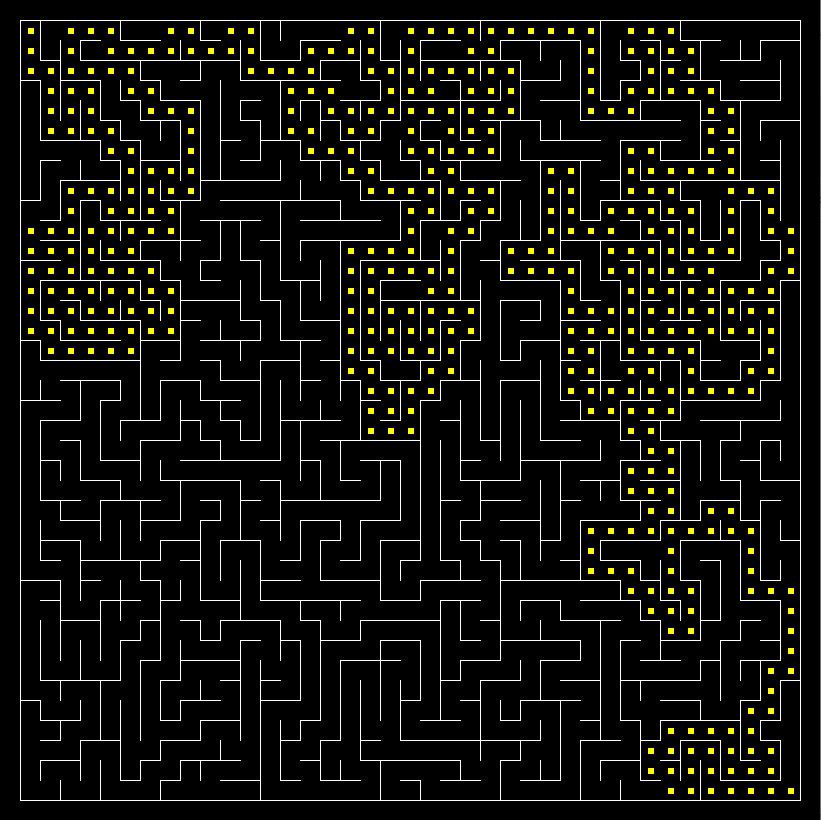

# MazeSolver
A Python script that generates a perfect maze and solves it using randomized DFS with backtracking.

See: [Maze generation algorithm](https://en.wikipedia.org/wiki/Maze_generation_algorithm#Randomized_depth-first_search)
---
Use by calling the Python script from a CLI with a parameter "size" indicating the size of the maze.

**Example:** To create a maze of size `40x40` you would write:

```
python3 solver.py 40
```

